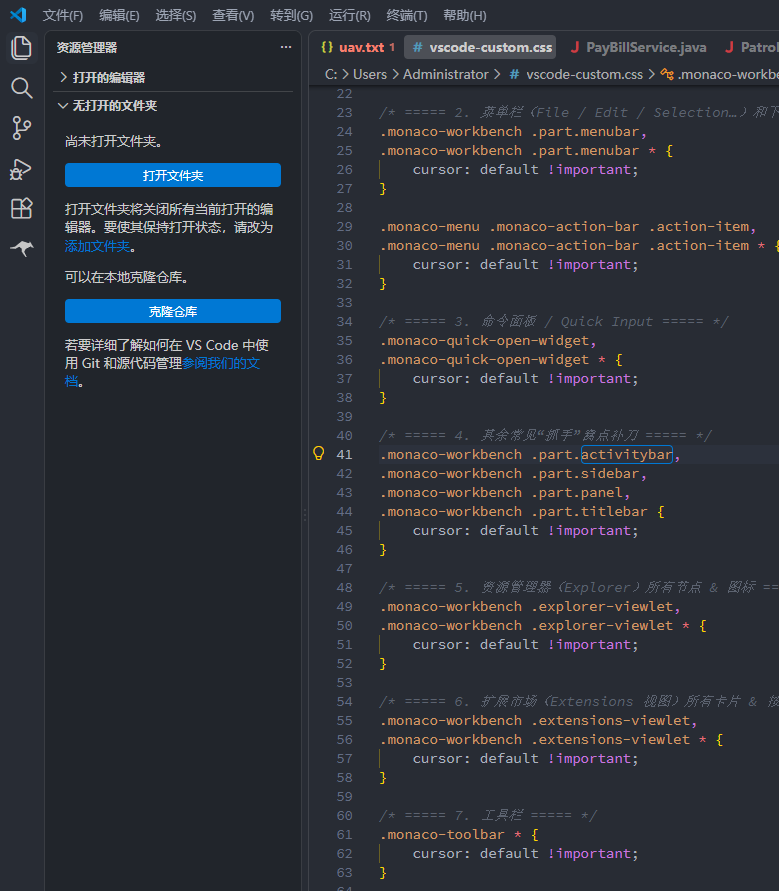
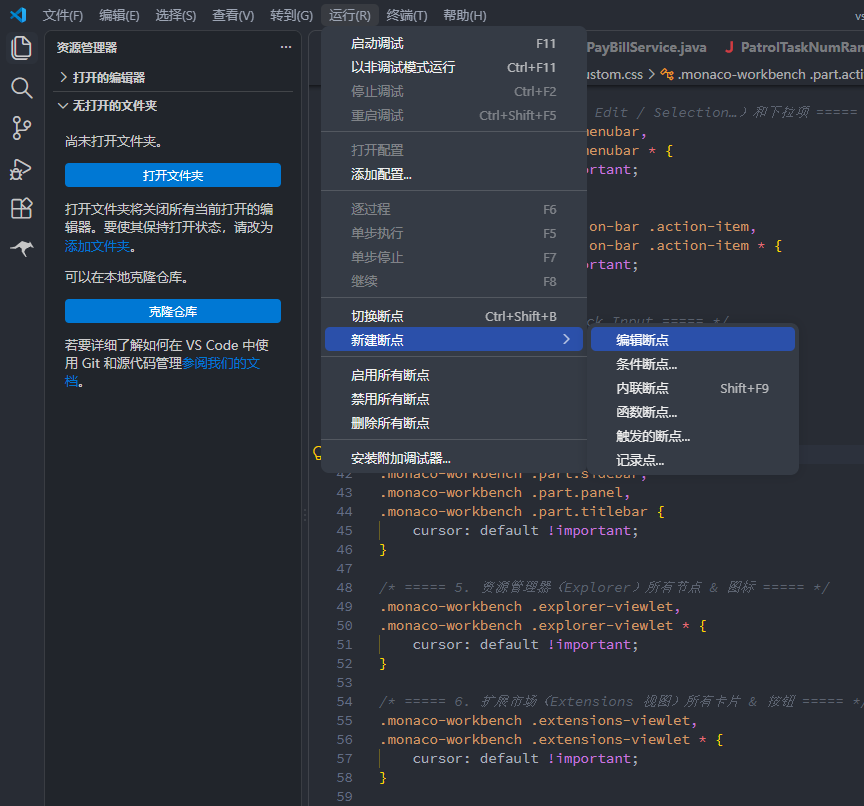
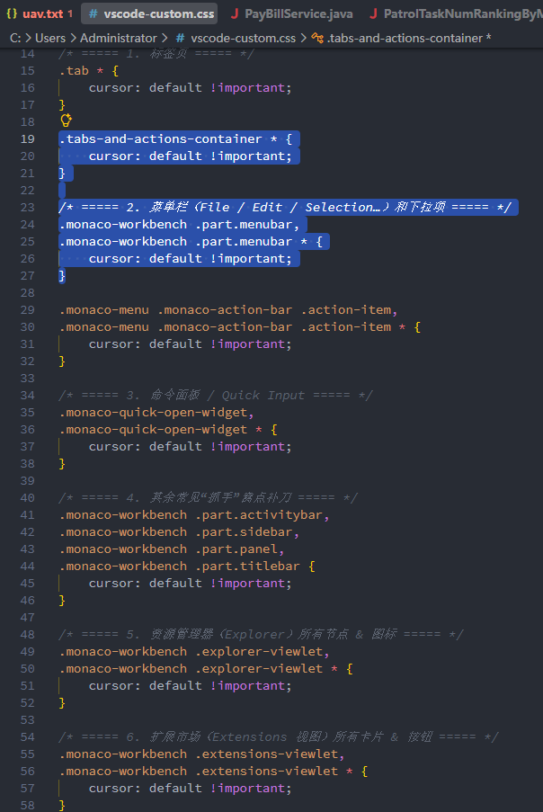
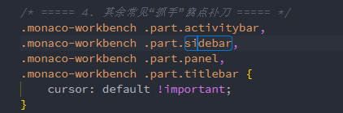
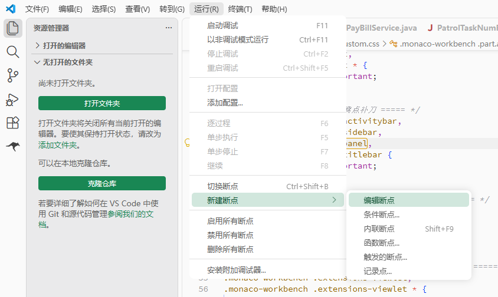
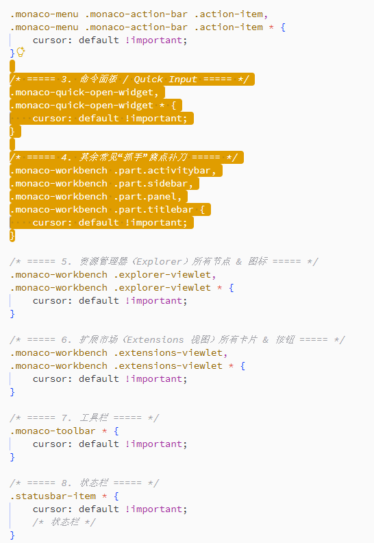
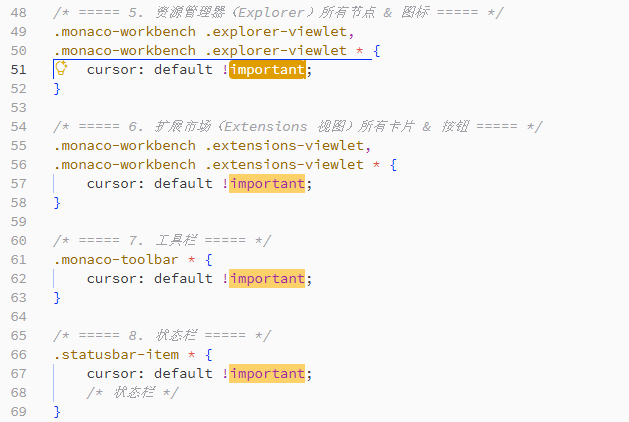
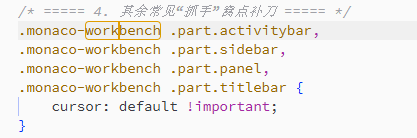

# vscode-custom-theme

A reusable VS Code customization for Atom One Dark and Atom One Light. It combines theme-scoped colors, rounded menu hover states, desktop-style mouse cursors, theme-scoped selected-text foregrounds, precise word highlighting, and optional native Mica or Acrylic window materials on Windows.

[中文说明](README_zh.md)

## Why this repository exists

This repository grew out of two long-standing VS Code usability pain points.

### 1. A desktop application that often feels like a web page

VS Code is a desktop application, but many parts of its interface copy the web convention of showing a pointing-hand cursor over buttons, menus, tabs, toolbar actions, and similar controls. That behavior has always felt out of place to me. Even after using VS Code for more than a decade, I still have not grown comfortable with it.

This customization restores a desktop-style interaction model: ordinary workbench controls use the default arrow, editable text keeps the I-beam, and genuine navigation interactions such as Ctrl+click “go to definition” can still use the pointer.

### 2. Great Atom One themes with interaction details left unfinished

Atom One Dark and Atom One Light are two of my favorite VS Code color themes, but their editor interaction states still leave room for improvement. For example, clicking a word produces a sharp rectangular border that feels inconsistent with VS Code's rounded visual language. Text selection, focus, and current-word highlighting can also look too similar, making it harder to judge exactly what is selected or focused.

This repository refines those details with rounded current-word borders, clearer selection colors, theme-scoped selected-text foregrounds, and more coherent menu, focus, cursor, and highlight states for both themes.

These are intentionally opinionated usability adjustments rather than a claim that one visual style fits everyone. Try them in daily use, compare the interaction states yourself, and adapt the settings to your own preferences.

## Features

- Atom One Dark keeps its blue accent character while making interaction states clearer.
- Atom One Light uses a green UI palette with a deep-yellow editor selection and cursor.
- Menu items use rounded hover backgrounds while submenus remain correctly scoped.
- Editor selection text stays white in both themes.
- Clicking a word frames only the current instance; the built-in highlighting of other occurrences is disabled. Text separated by the full-width Chinese colon `：` is handled correctly.
- Editor text keeps the I-beam cursor; ordinary workbench controls use the default arrow, while genuine navigation actions such as Ctrl+click keep the pointer.
- Theme colors coexist and can follow the Windows light/dark mode automatically.
- Windows 11 users can enable native Mica or Acrylic behind the translucent Atom One surfaces with a reversible script.

## Screenshots

### Atom One Dark

| Editor overview | Rounded menu hover |
|---|---|
|  |  |

| Selected text | Current-word border |
|---|---|
|  |  |

### Atom One Light

| Rounded menu hover | Editor selection |
|---|---|
|  |  |

| Selection detail | Current-word border |
|---|---|
|  |  |

## Included files

| Path | Purpose |
|---|---|
| `vscode-custom.css` | Workbench cursor, menu, rounded-corner, and editor visual overrides |
| `settings-snippet.jsonc` | Theme-scoped VS Code settings to merge into the user settings file |
| `extensions/local.selection-white-1.2.1/` | Local extension for theme-aware selected text and exact current-word borders |
| `scripts/vscode-material.ps1` | Enables, switches, reports, or disables the native Windows background material |
| `tests/vscode-material.Tests.ps1` | Verifies that every material mode is applied reversibly |

## Installation

1. Install the [Atom One Dark Theme](https://marketplace.visualstudio.com/items?itemName=akamud.vscode-theme-onedark), [Atom One Light Theme](https://marketplace.visualstudio.com/items?itemName=akamud.vscode-theme-onelight), and [Custom CSS and JS Loader](https://marketplace.visualstudio.com/items?itemName=be5invis.vscode-custom-css).
2. Clone or download this repository.
3. Merge the contents of `settings-snippet.jsonc` into your VS Code user `settings.json`. Do not replace your complete settings file.
4. Change `vscode_custom_css.imports` to the absolute `file:///` URL of your local `vscode-custom.css`.
5. Copy `extensions/local.selection-white-1.2.1` into `%USERPROFILE%\.vscode\extensions\`.
6. Run **Enable Custom CSS and JS** or **Reload Custom CSS and JS** from the command palette.
7. Run **Developer: Reload Window**.

## Windows Mica and Acrylic

The material layer is optional and intended for Windows 11. VS Code does not currently expose Electron's native background material as a setting, so the script applies two small, marked changes to the active installation's `out/main.js`. They enable the selected material and the Chromium alpha channel, remove VS Code's solid startup background color, and prevent the theme service from covering the material with another solid color after the workbench finishes loading. The script creates a safety backup beside that file and never restores the whole backup during a normal disable operation, so unrelated modifications are preserved.

Open PowerShell in this repository and choose a mode:

```powershell
# Windows Terminal-like translucent blur
powershell -ExecutionPolicy Bypass -File .\scripts\vscode-material.ps1 acrylic

# Quieter, more stable whole-window material
powershell -ExecutionPolicy Bypass -File .\scripts\vscode-material.ps1 mica

# Inspect or remove only this repository's patch
powershell -ExecutionPolicy Bypass -File .\scripts\vscode-material.ps1 status
powershell -ExecutionPolicy Bypass -File .\scripts\vscode-material.ps1 disable
```

Completely exit and reopen every VS Code window after changing modes. If the installation directory is protected, run PowerShell as Administrator. The script stops safely when a future VS Code build no longer contains the single expected window-creation site.

`tabbed` and `auto` are also accepted Electron material modes. The translucency levels are grouped under `Windows Mica / Acrylic material layer` near the end of `vscode-custom.css` for easy adjustment.

## Palette

| Context | Atom One Dark | Atom One Light |
|---|---:|---:|
| Main accent | `#0078D4` | `#198754` |
| Menu hover | `#2B50AA` | `#D1E7DD` |
| Editor selection | `#2B50AA` | `#E09D00` |
| Cursor and current-word border | `#0078D4` | `#E09D00` |

## VS Code upgrades

VS Code upgrades replace the generated `workbench.html` and install a new `out/main.js`. The source files in this repository remain valid. After an upgrade:

1. Run **Reload Custom CSS and JS**.
2. Run `scripts/vscode-material.ps1 acrylic` or your preferred material again.
3. Completely restart VS Code.

Custom CSS selectors depend on VS Code's workbench DOM and may need adjustment after a major UI change.

The native material patch is not an official VS Code setting. It is intentionally small and reversible, but a future Electron or VS Code change can require an update to the script.

## Notes

- `settings-snippet.jsonc` contains only settings related to this customization; it intentionally excludes accounts, credentials, license values, server addresses, and command history.
- The local extension disables the built-in occurrence highlight and replaces it with a precise word border based on `editor.wordSeparators`.
